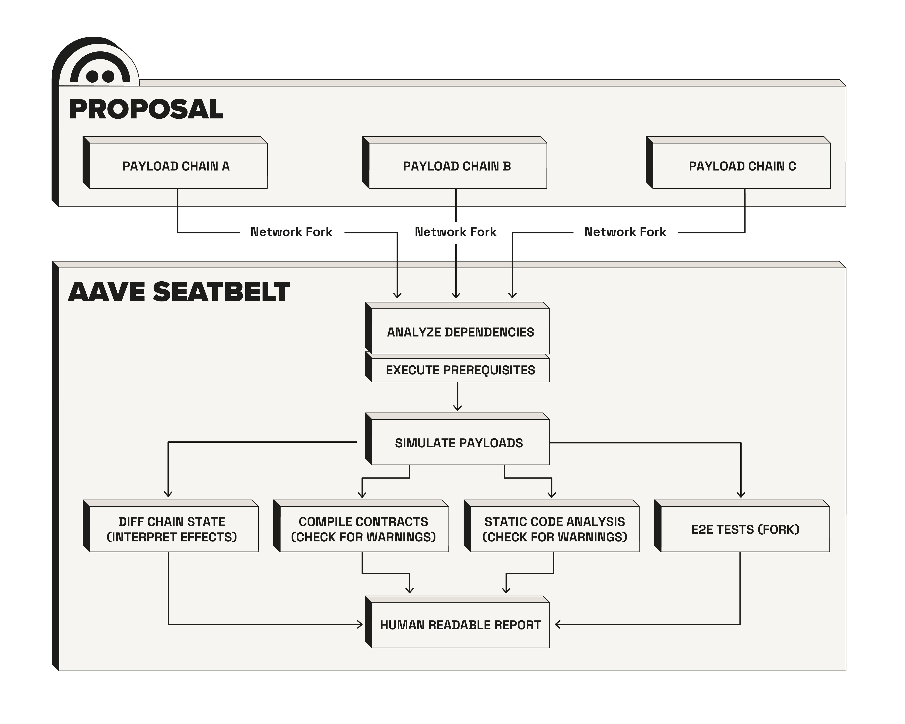

<p align="center"></a></p>

# Aave Seatbelt

A comprehensive toolset for making Aave on-chain governance safer through automated proposal verification and simulation.

## Overview

Aave Seatbelt executes and interprets governance proposal simulations by forking networks, simulating proposal execution, and generating detailed human-readable reports. This allows voters and developers to understand exactly what effects a proposal will have before it's executed on mainnet.



## Features

- **State change analysis**: Track all state changes caused by proposal execution
- **Event monitoring**: Capture and display all events triggered during execution
- **Contract compilation reports**: Identify potential warnings in affected contracts
- **Aave-specific interpretations**: Deep analysis of Aave Pool contracts and ecosystem changes
- **Multi-network support**: Simulate proposals across all Aave-supported networks
- **Dual simulation engines**: Tenderly-based simulation with Foundry fallback & e2e testing

## Prerequisites

- [Bun](https://bun.sh) runtime (see `.nvmrc` for version)
- [Foundry](https://getfoundry.sh) for local simulations
- RPC endpoints for target networks
- Tenderly account (for Tenderly-based simulations)

## Installation

```bash
bun install
```

## Configuration

Create a `.env` file in the project root (see `.env.example` for reference):

### Environment variables

```bash
# Provider Configuration

### Tenderly Mode
# In tenderly (js) mode, the system tries to use the rpcs in the following order
RPC_MAINNET=https://eth-mainnet.g.alchemy.com/v2/YOUR_KEY # 1. chain specific rpc if provided
# A list of supported chain selectors can be found here: https://github.com/bgd-labs/toolkit/blob/main/packages/toolbox/src/ecosystem/rpcs.spec.ts#L54
ALCHEMY_API_KEY=your_alchemy_api_key # 2. alchemy if alchemy key is provided and alchemy supports the network
QUICKNODE_TOKEN=your_quicknode_token # 3. quicknode if quicknode token is provided and quicknode supports the network
QUICKNODE_ENDPOINT_NAME=your_endpoint_name
HYPER_RPC_API_TOKEN=your_hyper_rpc_token # 4. hyper rpc if hyper rpc token is provided and hyper rpc supports the network
# 4. fallback to the viem default rpc of that network

# Tenderly Configuration (for Tenderly simulations)
TENDERLY_ACCESS_TOKEN=your_tenderly_access_token
TENDERLY_PROJECT_SLUG=your_project_slug
TENDERLY_ACCOUNT=your_account_name

### Foundry mode
# In foundry-rs mode, resolving rpcs automatically is not supported.
# Therefore please refer to the foundry.toml [rpc_endpoints] section.

### Optional configs and flags
# Indexer API (speeds up transaction lookups)
# If kept empty, the system will use eth_getLogs to lookup transactions or omit transaction lookup depending ont he case
INDEXER_API=

# Etherscan API (for contract verification in reports)
ETHERSCAN_API_KEY=your_etherscan_api_key
# An optional explorer proxy can be supplied which will redirect all requests to any explorer to the specified url instead
# This can be useful for private development(using a private explorer) and for caching between runs
EXPLORER_PROXY=

# Debug and Development Options
VERBOSE=true                # Enable verbose logging
# Always use Foundry
FORCE_FORGE=true
# For decoding events we optionally rely on a local collection of known events
# When the flag is set true, any run will add missing events to the collection
UPDATE_EVENT_DB=true       # Update event database after simulations
```

## Usage

### Basic usage

Simulate all pending payloads across all networks:

```bash
bun simulate
```

### Simulate specific payload(s)

```bash
# Simulate a single payload
bun simulate -c 1 -i 42

# Simulate multiple payloads
bun simulate -c 1 -i 42,43,44
bun simulate -c 1 -i 42 43 44

# Simulate on a specific payloads controller
bun simulate -c 1 --payloadsController 0x1234...5678 -i 42
```

### Available commands

| Command               | Description                              |
| --------------------- | ---------------------------------------- |
| `bun simulate`        | Refresh cache and simulate payloads      |
| `bun run ci:tree`     | Refresh the governance tree cache only   |
| `bun run ci:simulate` | Run simulations without refreshing cache |

### Command options

- `-c, --chainId <chainId>` - Chain ID of the network to simulate on (required)
- `-i, --ids <ids...>` - Payload ID(s) to simulate (comma or space separated)
- `--payloadsController <address>` - Specific payloads controller address (optional). The supplied payloadsController must maintain an equivalent storage layout for the `payloads` compared to the Aave `PayloadsController` contract. Currently, both `PayloadsController` and `PermissionedPayloadsController` are supported.

## Modes

### Tenderly mode

`Tenderly mode` allows you to simulate payloads on the Tenderly platform.
To use this mode, you need to have a Tenderly account and API key configured.
`Tenderly mode` provides sophisticated state decoding even for complex types(structs, mappings, arrays) for any touched contracts.

### Foundry mode

`Foundry mode` allows you to simulate payloads against a local anvil fork.
You can use the foundry simulations for any chain that is supported by foundry.
`Foundry mode` will do "some" state decoding, for known contracts & slots, but is less sophisticated than the tenderly version.
In addition, `Foundry mode` will run an e2e test suite against the fork after payload execution.

## Output

Simulation reports are generated in the `reports/payloads/` directory, organized by:

```
reports/
└── payloads/
    └── {chainId}/
        └── {payloadsControllerAddress}/
            └── {payloadId}.md
```

Each report includes:

- Payload metadata and current state
- Complete state changes with before/after values
- All emitted events during execution
- Contract compilation warnings (if any)
- Aave-specific interpretations and risk assessments

## How it works

1. **Cache refresh**: Fetches the latest governance tree and payload information
2. **Payload discovery**: Identifies non-finalized payloads from the governance system
3. **Simulation strategy**: Generates execution strategy including pre-execution steps
4. **Tenderly simulation**: Attempts simulation on Tenderly's platform (faster, more detailed)
5. **Foundry fallback**: If Tenderly fails or is unavailable, falls back to local Foundry simulation
6. **Report generation**: Produces markdown reports with detailed analysis
7. **State caching**: Stores simulation results to avoid re-processing

## CI/CD flow

- [cron.yaml](.github/workflows/cron.yaml): Every 2 hours, the system automatically checks for new payloads and runs simulations when necessary.
- [trigger.yaml](.github/workflows/trigger.yaml): Allows manual triggering of simulations via GitHub Actions. Currently, [BGD Labs](https://bgdlabs.com) is operating a monitoring service that automatically triggers simulations for new payloads, but this integration can be replaced by any other indexing service.

## License

MIT
